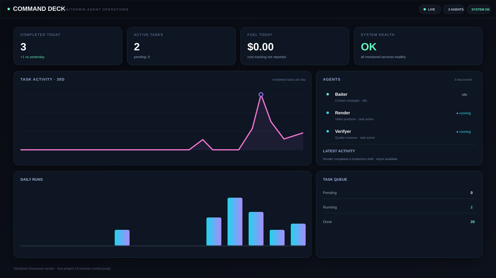
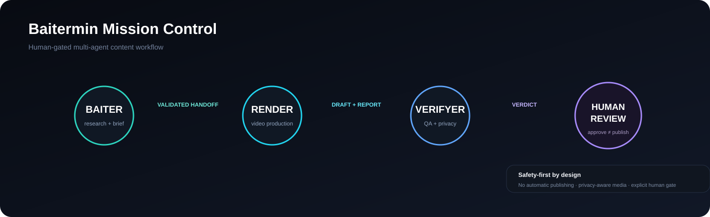
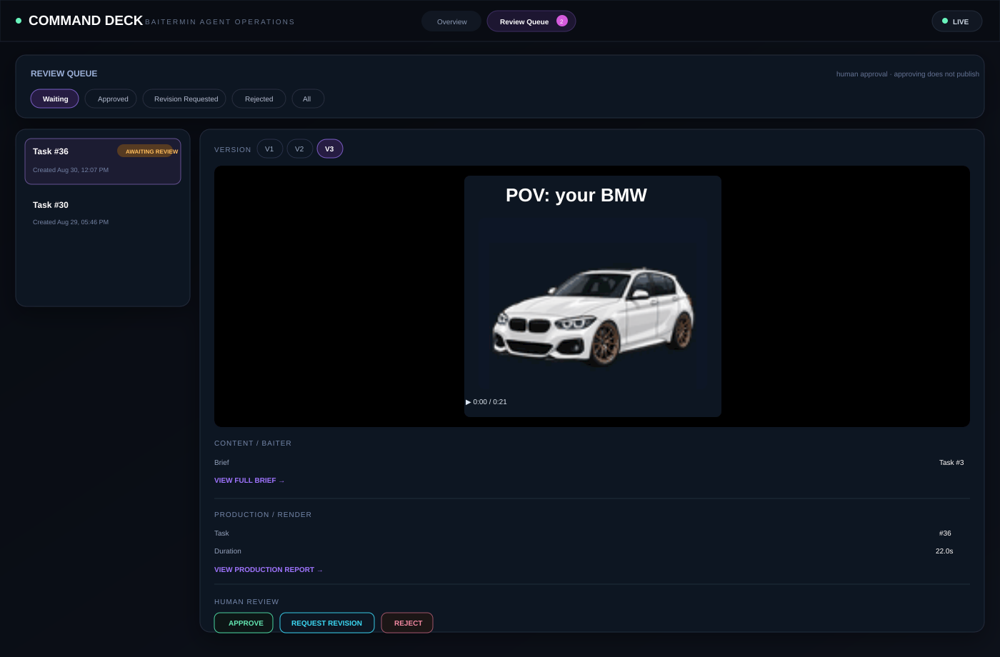

<div align="center">

# 🧠 Baitermin Mission Control

### Local-first multi-agent automotive content operations


</div>

> **Public showcase only.** The real Baitermin Mission Control ecosystem is developed in a private repository. This repository intentionally contains no credentials, private databases, raw user media, agent memory, provider configuration, or sensitive runtime state.



## What is Baitermin Mission Control?

Baitermin Mission Control is a local-first multi-agent production system I am building for automotive short-form content.

The system combines specialized AI agents with deterministic local tooling for research, scripting, video production, privacy processing, quality assurance and human review.

The core principle is simple:

> **Automate the production pipeline, but keep important decisions human-controlled.**

The project has evolved from an early visual HQ prototype into a real operational Command Deck with working agent orchestration, video rendering, QA, revision history and human approval workflows.

---

## Current workflow



The production roles are deliberately separated:

- **Baiter** — research, content strategy, briefs and grounded content planning.
- **Render** — deterministic/local video production and media assembly.
- **Verifyer** — technical, visual, factual and privacy QA.
- **Human Review** — the final decision gate before any future publishing stage.

Approving a video in Human Review **does not publish it**.

---

## Command Deck

The Command Deck is the operational dashboard for the ecosystem.

It currently surfaces:

- live agent state
- active/completed task metrics
- task activity history
- system health
- latest production activity
- task queue state
- per-agent runtime visibility
- direct links to reports and review artifacts

The UI is designed to make an otherwise invisible multi-agent workflow understandable at a glance.


---

## Human Review Queue

The Review Queue is the safety gate between automated production and any future publishing workflow.

Current capabilities include:

- video playback directly inside the review screen
- version selection (`V1`, `V2`, `V3`, ...)
- Baiter brief access
- Render production report access
- Verifyer QA verdict access
- **Approve** / **Request Revision** / **Reject**
- immutable human review history
- Change Decision support while preserving audit history
- thread-wide review history across versions
- automatic selection of a Waiting review when the page opens
- automatic advance to the next Waiting review after a decision, when one exists
- polling that never steals the review the user is currently watching



The latest UX improvement keeps the review flow fast without making any decision automatically.

---

## Visual production system

A major part of Mission Control is a reusable vertical automotive video system.

The current foundation includes:

- 1080×1920 / 30fps vertical rendering
- illustrated scenes
- real-footage scenes
- hybrid scenes
- reusable Baitermin mascot poses
- local voiceover generation
- caption timing and motion presets
- original reusable vehicle art
- source-audio / exhaust-audio beats
- deterministic FFmpeg validation
- privacy-safe user-owned media derivatives

The goal is a repeatable production style inspired by modern short-form automotive explainers while keeping the actual visual identity original to Baitermin.

---

## Vehicle art: `hero_base` + `hero_max`

Each important vehicle family can now support two separate illustrated roles.

### `hero_base`

Used when the video is explaining the actual vehicle/platform:

- OEM specifications
- stock comparisons
- engine/platform explanation
- buying-guide context
- factual base-car scenes

### `hero_max`

Used for more aggressive channel visuals:

- tuning/performance hooks
- modified-build discussion
- transition hero shots
- channel identity
- high-energy automotive scenes

The F20 family is the first implementation of this model.

A permanent rule keeps visuals and facts separate:

> **Visual modification does not create factual evidence.**

A widebody, wing or aggressive wheels in `hero_max` are visual storytelling — not claims that the stock car came that way.

---

## Visual routing: from intent to approved asset

Content strategy talks to the visual system in terms of **intent**, not raw file paths:

```text
Content Strategy
      ↓
Production Visual Intent
      ↓
Visual Routing Policy
      ↓
Approved Visual Mode / Asset
      ↓
Production
      ↓
Visual Composition
      ↓
Rendered Output
      ↓
Independent Verification
      ↓
Human Review
```

Examples:

- OEM / factual presentation → clean base vehicle visual
- tuning / performance presentation → performance-oriented hero visual
- real proof → real footage
- hybrid compositions → an independent hybrid mode, never a fallback

The routing policy only ever selects from already-approved visual modes/assets. An explicit request for the performance-oriented visual never silently receives the base visual instead, and no new artwork is ever generated automatically.

> **Designed or modified visuals are presentation assets, not factual evidence of real-world modifications.**

Approved illustrated vehicle assets can be selected, passed into production composition, and rendered into actual visual output — this is real composition, verified against actual rendered frames, not just asset selection or metadata.

Composed illustrated output can now be independently verified against production intent and actual composition provenance before entering Human Review. The verification step does not simply trust what production says it used — it checks that claim against its own independently-established expectation and against a tamper-evident record of what was actually composed:

```text
Expected
   ↓
Production Claim
   ↓
Actual Composition
   ↓
Artifact Integrity
   ↓
Verification Result
   ↓
Human Review
```

- **Expected** — established independently, not read from the production claim.
- **Production Claim** — what the production step says it used; never trusted on its own.
- **Actual Composition** — a record of what was genuinely produced, kept separate from the claim.
- **Artifact Integrity** — the rendered file is checked against that record, so a technically valid file that was altered or swapped afterward is still caught.
- A mismatch anywhere in this chain blocks the result rather than passing silently.

**Verification success makes the result ready for human review; it does not automatically approve or publish the content.** This capability is available to production; it does not mean every live brief automatically uses the illustrated path, and hybrid composition remains a future step.

---

## Privacy-first automotive media

Real car footage creates a recurring privacy problem: registration plates.

Mission Control now uses a plate-aware privacy pipeline designed to target the **physical registration plate**, not a giant generic rectangle over the back of the vehicle.

```text
raw user-owned media
        ↓
logical media id
        ↓
plate localization + tracking
        ↓
small privacy mask
        ↓
privacy-safe derivative
        ↓
Render
        ↓
Verifyer
        ↓
Human Review
```

Important behavior:

- raw media stays unchanged
- the plate is tracked rather than the whole rear of the car
- uncertainty fails closed instead of creating an enormous blur region
- background plates can be treated independently
- privacy-safe can still fail visual QA if masking is excessive

This was validated against real user-owned footage before being accepted as the current privacy direction.

---

## Grounded research & content claims

The content architecture is moving toward production packages where factual statements are traceable instead of being generated from model memory alone.

Claims can be separated into categories such as:

- OEM specifications
- tuner claims
- dyno/test results
- current-market information
- owner-build information
- qualitative conclusions

Source authority is tracked separately from the type of claim.

For example:

- a BMW specification should prefer a real BMW/primary source
- a tuner power figure remains a tuner claim
- a specific Baitermin build figure remains an owner-build claim
- a secondary aggregator cannot masquerade as an OEM primary source

This separation will become part of the production Baiter → Render → Verifyer pipeline.

---

## Safety architecture

Some of the less visible work is focused on making the workflow safe and predictable.

Current principles include:

- human approval before any future publishing
- no automatic social posting
- agent responsibilities remain separated
- tokenless agent task-control workflow
- operator credentials stay outside model-visible context
- logical asset/media IDs rather than arbitrary filesystem paths
- raw user media remains immutable
- privacy failures fail closed
- Render waits for and validates real encoding processes
- Verifyer does not silently repair bad content — it can block it
- deterministic tooling is preferred when deterministic tooling is the better fit

---

## Current development status

The private implementation is actively evolving and is ahead of this sanitized public repository.

### Proven / substantially implemented

- ✅ Command Deck operational dashboard
- ✅ Baiter / Render / Verifyer agent roles
- ✅ local task orchestration
- ✅ tokenless task-control migration
- ✅ Render process safety
- ✅ Verifyer QA workflow
- ✅ Human Review Queue
- ✅ review versions and thread-wide history
- ✅ controlled revision orchestration foundations
- ✅ Waiting review auto-selection UX
- ✅ local voiceover and audio pipeline
- ✅ illustrated / real-footage / hybrid rendering
- ✅ plate-aware privacy tracking
- ✅ visible flame / real source-audio production proof
- ✅ `hero_base` / `hero_max` vehicle-art variant architecture
- ✅ real Stage 7 content prototype with grounded research + user-owned footage
- ✅ production-facing visual-intent routing capability (Production Intent → Visual Routing Policy → Approved Visual Mode/Asset)
- ✅ production workflow now carries visual intent from content strategy into production and resolves it through that routing layer
- ✅ approved illustrated vehicle assets can be composed into real rendered visual output
- ✅ composed illustrated output can be independently verified against production intent and actual composition provenance before Human Review

### Current focus

The next major milestone is **Production Workflow Integration**:

```text
Baiter
  ↓
Render
  ↓
Verifyer
  ↓
Human Review
```

The first production integration is intentionally planned to stop at **Awaiting Human Review**.

No Publisher is part of that stage.

Production visual intent now flows from content strategy into the production workflow, is resolved through the routing layer described above, and approved illustrated assets can be composed into real rendered visual output. That composed output can now also be independently verified against intent and actual composition provenance ahead of Human Review, using the trust model described above. Completing hybrid composition, deeper Verifyer integration, and any future Publisher stage remain later work — none of it is part of this milestone.

---

## Technology

Mission Control uses a pragmatic local stack rather than forcing every job into one framework:

- JavaScript / Node.js
- Python
- HTML / CSS / vanilla browser JavaScript
- SQLite
- OpenCV
- Pillow
- FFmpeg
- local TTS
- Git / GitHub
- local agent orchestration

Earlier experimental UI work also explored React, TypeScript, Vite and PixiJS. The current operational Command Deck is intentionally much simpler and more direct.

---

## Why this is a showcase repository

The full ecosystem remains private while it is being built.

This public repository exists to show:

- product direction
- current UI
- workflow architecture
- safety philosophy
- selected sanitized progress

It intentionally does **not** mirror the production source tree.

---

## Project principles

- **Human approval before publication**
- **Approving does not equal publishing**
- **Agents have distinct responsibilities**
- **Research should be traceable to evidence**
- **Raw user media stays immutable**
- **Privacy failures fail closed**
- **Visual privacy must also look good**
- **Logical IDs instead of arbitrary file paths**
- **No silent factual invention by Render**
- **No silent content repair by Verifyer**
- **Public showcase stays sanitized**

---

<div align="center">

### 🚧 Actively in development

The screenshots, architecture and feature list in this repository are updated as the private Mission Control ecosystem evolves.

**Built by [Baitermin](https://github.com/Baitermin)**

</div>
